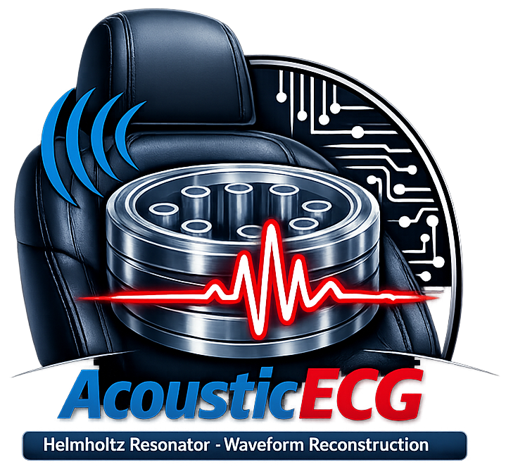

<div align="center">



# Wav2ECG: Non-Invasive Cardiac Sensing via Acoustic Helmholtz Resonator Cavity

[](https://www.python.org/)
[](https://pytorch.org/)
[](LICENSE)

This repository contains the source code, data processing pipelines, trained model checkpoints, and evaluation scripts accompanying the paper:

> *Toyota Research Institute of North America (TRINA)*

</div>

---
## Overview

**Wav2ECG** is the software component of an end-to-end non-invasive cardiac monitoring system that combines a custom-designed **acoustic Helmholtz resonator cavity** with deep neural networks to reconstruct electrocardiogram (ECG) waveforms directly from acoustic heart sound signals. The Helmholtz resonator cavity is an acoustic sensor tuned to the [50–120] Hz frequency range where cardiac-generated pressure waves reside. A pressure-acoustic sensor inside the cavity captures heart sounds through layers of clothing and seat foam without any direct body contact. The captured acoustic signal is then processed by a **Conv-TasNet** (Convolutional Time-domain Audio Separation Network, originally developed for speech separation) which is repurposed here to reconstruct the full ECG waveform including identifiable PQRST morphology.

---

## Table of Contents

- [Overview](#overview)
- [Installation](#installation)
  - [Prerequisites](#prerequisites)
  - [Setup](#setup)
- [Project Structure](#project-structure)
- [Configuration](#configuration)
- [Datasets](#datasets)
  - [Supported Data Sources](#supported-data-sources)
  - [Data Preprocessing Pipeline](#data-preprocessing-pipeline)
- [Models](#models)
- [Training](#training)
- [Inference](#inference)
  - [Single-File Prediction](#single-file-prediction)
  - [Analysis Notebooks](#analysis-notebooks)
- [Citation](#citation)
- [Related Work](#related-work)
- [License](#license)
- [Acknowledgements](#acknowledgements)

---

## Installation

### Prerequisites

- **Operating System:** Windows 10/11 
- **Python:** == 3.11.4
- **CUDA:** Optional (CPU inference supported; GPU recommended for training)
- **Conda:** [Anaconda](https://www.anaconda.com/)

### Setup

1. **Create and activate a conda environment:**

   ```bash
   conda create -n wav2ecg python=3.11
   conda activate wav2ecg
   ```

2. **Clone the repository:**

   ```bash
   git clone https://github.com/klean2050/wav2ecg.git
   cd wav2ecg
   ```

3. **Install the package and dependencies:**

   ```bash
   pip install -e .
   ```

   This installs all required dependencies listed below, look for requirement.txt for complete list. 

   | Package | Version 
   |---------|---------|
   | `torch` | < 2.0.1 |
   | `torchaudio` | 2.02 |
   | `asteroid` | 0.6.0 | 
   | `neurokit2` | 0.2.5 | 
   | `scipy` | 1.10 | 
   | `numpy` | 1.25.2 | 
   | `pandas` | 2.0.3 | 
   | `tensorboard` | 2.14.0 | 
---

## Project Structure

```
wav2ecg/
├── wav2ecg.py                          # Main training script
├── predict.py                          # Single-file ECG prediction from audio
├── inference.py                        # Batch inference on test split
├── inference_mc_mae.py                 # Multi-channel inference with MAE analysis
├── print_global_mae.py                 # Global HRI MAE and heart rate analysis
├── methods.py                          # Auxiliary helper methods
├── utils.py                            # Global configuration and parameters
├── setup.py                            # Package installation script
├── README.md                           # This file
│
├── loaders/                            # Dataset loading classes
│   ├── __init__.py                     # get_dataset() factory function
│   ├── cavity.py                       # CavityDataset  (4 kHz cavity accelerometer)
│
├── models/                             # Neural network architectures
│   ├── __init__.py                     # Model exports
│   ├── convtasnet.py                   # Conv-TasNet + GRL variant
│
├── metrics/                            # Evaluation metrics
│   ├── __init__.py                     # Metric exports
│   ├── heart_rate.py                   # RR intervals and heart rate (BPM)
│   ├── mse_rec.py                      # Mean Squared Error (MSE)
│   └── r_peaks.py                      # R-peak localization accuracy
│
├── ckpt/                               # Trained model checkpoints (.pt)
├── cavity_data/                        # Dataset storage
│   └── _processed/                     # Pre-processed segments
├── dtw_analysis/                       # DTW analysis outputs
│
├── check_nn_performance.ipynb          # NN performance evaluation notebook
├── inspect_cavity_data.ipynb           # Cavity data inspection notebook
└── dynamic_time_warping.ipynb          # DTW analysis notebook
```

---

## Configuration

All global parameters are configured in **`utils.py`**. Modify these before training or inference:

```python
# Data parameters
data_name      = "cavity_data"    # Training dataset: "cavity_data", "mirise", "steth_exp", "all"
test_name      = "cavity_data"    # Test dataset
sample_rate    = 2000             # Target sample rate (Hz)
batch_size     = 8                # Training batch size
peak_threshold = 0.4              # Threshold for R-peak detection

# Model parameters
model_name    = "conv-tasnet"     # Options: "stft", "unet", "conv-tasnet", "sepformer"
learning_rate = 1e-5              # Initial learning rate
num_epochs    = 50                # Number of training epochs

# Spectrogram parameters (for STFT-based models)
n_fft       = 256                 # FFT window size
hop_length  = 128                 # Hop length

# Paths
dir_save    = "..."               # Checkpoint save directory
dir_dataset = "..."               # Dataset root directory
```

---

## Datasets

### Supported Data Sources
Link to the data: TBD

| Dataset | Sensor Type | Native Sample Rate | Format | Description |
|---------|------------|-------------------|--------|-------------|
| **Cavity** (`cavity_data`) | Acoustic Helmholtz resonator cavity | 4,000 Hz | `.wav` (PCG) + `.csv` (ECG) | In-vehicle cardiac monitoring via cavity-mounted shear transducer. 13 participants, ~7 hours of data. |

### Data Preprocessing Pipeline

All dataset classes apply a standardized preprocessing pipeline:

1. **Resample** to a unified 2 kHz sample rate
2. **Segment** recordings into 4-second windows (8,000 samples)
   - Training / Validation: 50% overlap between consecutive segments
   - Testing: No overlap
3. **Discard** incomplete trailing segments
4. **Filter** signals to the frequency range of interest:
   - **ECG:** 0.5 Hz high-pass Butterworth filter (5th order) + powerline filtering via `neurokit2`
   - **PCG:** 25–50 Hz band-pass Butterworth filter (5th order)
5. **Save** pre-processed segments to `_processed/` folders:
   - ECG → `.csv` format
   - PCG → `.wav` format

**During training**, additional augmentation is applied:

6. **Normalize** each segment by dividing by its `max()` value
7. **Add white Gaussian noise** at a randomly selected SNR level from {0, 30, 60, 90} dB — applied to PCG only

---

## Models

| Model | Key | Architecture | Parameters | Description |
|-------|-----|-------------|------------|-------------|
| **Conv-TasNet** | `conv-tasnet` | 1D Encoder → TCN Separator → Decoder | N=512, L=16, B=128, H=512, P=3, X=8, R=3 | Convolutional Time-domain Audio Separation Network using dilated depthwise separable convolutions. Default and recommended model. |

---

## Training

1. **Configure** your training parameters in `utils.py` (dataset, model, learning rate, epochs, paths).

2. **Run the training script:**

   ```bash
   python wav2ecg.py
   ```
---

## Inference

### Batch Inference on Test Set

Run inference on the entire held-out test split and save predictions:

```bash
python inference.py
```

This loads the test split specified in `utils.py`, runs the model on all samples, and saves outputs to `results/`:
- `*_pred.npy` — Model ECG predictions
- `*_true.npy` — Ground truth ECG

For multi-channel inference with MAE analysis:

```bash
python inference_mc_mae.py
```

### Single-File Prediction

Reconstruct ECG from a single audio file (`.wav` or `.mat`):

```bash
python predict.py path/to/your/recording.wav
```

**Supported input formats:**
- `.wav` — Single-channel PCG audio
- `.mat` — MATLAB file with `data` variable (channel 0 = ECG, channel 1 = PCG)

The script will:
1. Load and resample the input to 2 kHz
2. Segment into overlapping 4-second windows
3. Run inference on each segment
4. Merge overlapping predictions via averaging
5. Save the reconstructed ECG to `results/` in numpy (`.npy`) format

---

### Analysis Notebooks

The project includes several Jupyter notebooks for detailed result analysis:

- **`check_nn_performance.ipynb`** — Evaluate model predictions, compute metrics, and visualize reconstructed waveforms
- **`inspect_cavity_data.ipynb`** — Inspect the cavity dataset, reconstruct continuous signals, and perform heartbeat matching analysis
- **`dynamic_time_warping.ipynb`** — DTW-based temporal alignment analysis between predicted and ground truth ECG

---

## Citation

If you use this code, framework, or data pipeline in your research, please cite the following paper:

```TBD
```
---

## Related Work

This project builds on and references the following prior work:

- **Conv-TasNet:** Luo, Y., & Mesgarani, N. (2019). *Conv-TasNet: Surpassing Ideal Time–Frequency Magnitude Masking for Speech Separation.* IEEE/ACM Transactions on Audio, Speech, and Language Processing, 27(8), 1256–1266. [DOI: 10.1109/TASLP.2019.2915167](https://doi.org/10.1109/TASLP.2019.2915167)

- **FastNVG R-Peak Detection:** Emrich, J., Koka, T., Wirth, S., & Muma, M. (2023). *Accelerated sample-accurate R-peak detectors based on visibility graphs.* Proceedings of EUSIPCO 2023. [DOI: 10.23919/EUSIPCO58844.2023.10290007](https://doi.org/10.23919/EUSIPCO58844.2023.10290007)

- **NeuroKit2:** Makowski, D. et al. (2021). *NeuroKit2: A Python toolbox for neurophysiological signal processing.* Behavior Research Methods, 53(4), 1689–1696. [DOI: 10.3758/s13428-020-01516-y](https://doi.org/10.3758/s13428-020-01516-y)

- **AdamW:** Loshchilov, I., & Hutter, F. (2017). *Decoupled weight decay regularization.* arXiv:1711.05101.

---

## License

This project is licensed under the **MIT License**. See the [LICENSE](LICENSE) file for details.

---

## Acknowledgements

- **Toyota Research Institute of North America (TRINA)** — Electronics Research Department
- **MIRISE Technologies** — Research support

---

<div align="center">

</div>
